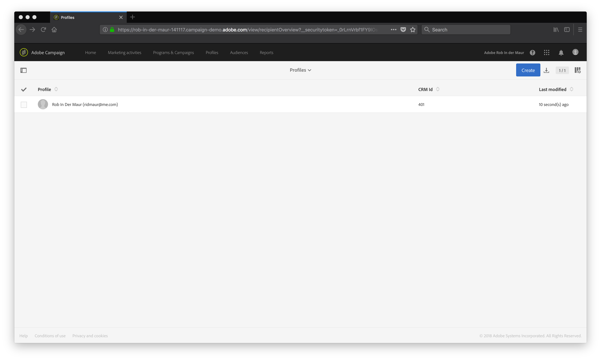

# Using Adobe Campaign Standard with Adobe I/O Runtime
In this exercise we are going to create the same account in Adobe Campaign Standard, using the CRM Id we retrieved from Hubspot. Such a CRM Id is typically used in the connection between customer information and marketing automation.

## Objective
The objective of this exercise is to understand how Adobe I/O runtime can work with Adobe solutions and also understand how more complex functions can be deployed in Adobe I/O runtime.

## How does it work?
We first need to ensure we have set up our code properly before creating the relevant action in Adobe I/O Runtime. ACS is a bit more secure in accessing its functionality through API's. This is done with the help of Adobe I/O tools and configuring the correct JSON Web Token (JWT). Using this JWT, we can generate an access token that can be used to access ACS functionality through its API's.

All parameters to generate an access token are defined in *config.js*. You do not have to worry about this as part of this lab, but you can find more information on how to set up an integration for Adobe I/O at https://console.adobe.io.

The actual code for implementing the action you can find in *app.js*. There you'll find a function named *CreateACSProfile* that takes all parameters (email, firstname, lastname, crmId) as input to create a contact in ACS. The function is called as part of a POST request to the Adobe I/O endpoint for this ACS instance: `https://mc.adobe.io/rob-in-der-maur-141117.campaign-demo.adobe.com/campaign/profileAndServicesExt/profile/`.

## Try it!
### Create ACS Create Profile Action
To deploy the action we need to bundle all the code for this action in a ZIP file. Make sure you are in the *acs* directory. You can do this using following command:
```
$ rm action.zip
$ zip -r action.zip .
```
The first line is to ensure we remove a previous `action.zip` before building the new ZIP file.

We will use `action.zip` file as the definition for our action. To create the action use the following command:
```
$ wsk action create seatXX/createprofile action.zip --kind nodejs:6 --web true -v
```
With the `--kind nodejs:6` parameter we tell Adobe I/O Runtime that this action requires functionality from the embedded NodeJS (version 6) that is available in Adobe I/O Runtime. With the `--web true` parameter, this function can also be invoked through a browser.

If the action is created successful, you will see:
```
$ ok: created action seatXX/createprofile
```

### Invoke ACS Create Profile Action
In order to test whether the action works we will now use a browser. Go to a web browser on your lab machine and invoke the action by going to the URL below. Again, replace the part of the URL indicating your seat number (`XX`), as well as parameters like `<firstName>` with proper values. Also, ensure you will encode the parameters properly (e.g. use `%20` for spaces). And note that the parameters for `lastName` and `firstName` do have a capital `N`. Lower- and uppercase does matter...
```
https://runtime.adobe.io/api/v1/web/summit-emea-lab-unlock-adobeio-namespace/seatXX/createprofile?email=<email>&firstName=<firstName>&lastName=<lastName>&cusCrmId=<custCrmId>
```

You will not see anything appearing in the browser upon successful completion of this action. But if you do see an error, e.g like
```
{
error: "The requested resource does not exist.",
code: 979155
}
```
check the syntax of your URL. You might be pointing to an incorrect endpoint or there are some issues with your parameters.

### Check ACS
To check whether your profile has made it into Adobe Campaign Standard, go to [ACS](https://rob-in-der-maur-141117.campaign-demo.adobe.com). In ACS, click on the **Customer Profiles** tile. You will see your profile, similar to what is shown in screenshot below:


## What's Next?
* [Exercise 4: Combining Adobe I/O Runtime Actions in a Sequence](../sequence/)

